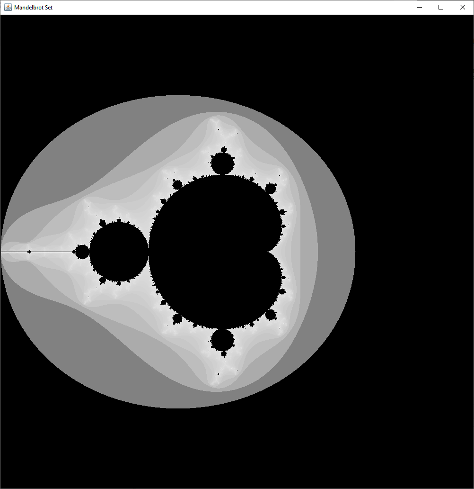

# java-mandelbrotdrawing
A mandelbrot set drawing script in java.

## General info
Created in Eclipse IDE. 
Draws a single image of the Mandelbrot set. Change the x0, x1, y0, y1 values to change the coordinates of the mandelbrot set that are drawn.

### Mandelbrot set
The Mandelbrot set (/ˈmændəlbrɒt/) is the set of complex numbers *c* for which the function $F_c (z) = z^2 + c$ does not diverge when iterated from $z = 0$, i.e., for which the sequence $F_c (0)$, $F_c (F_c (0))$, etc., remains bounded in absolute value. Its definition is credited to Adrien Douady who named it in tribute to the mathematician Benoit Mandelbrot, a pioneer of fractal geometry.[1]
 
[source](https://en.wikipedia.org/wiki/Mandelbrot_set)

### Examples

