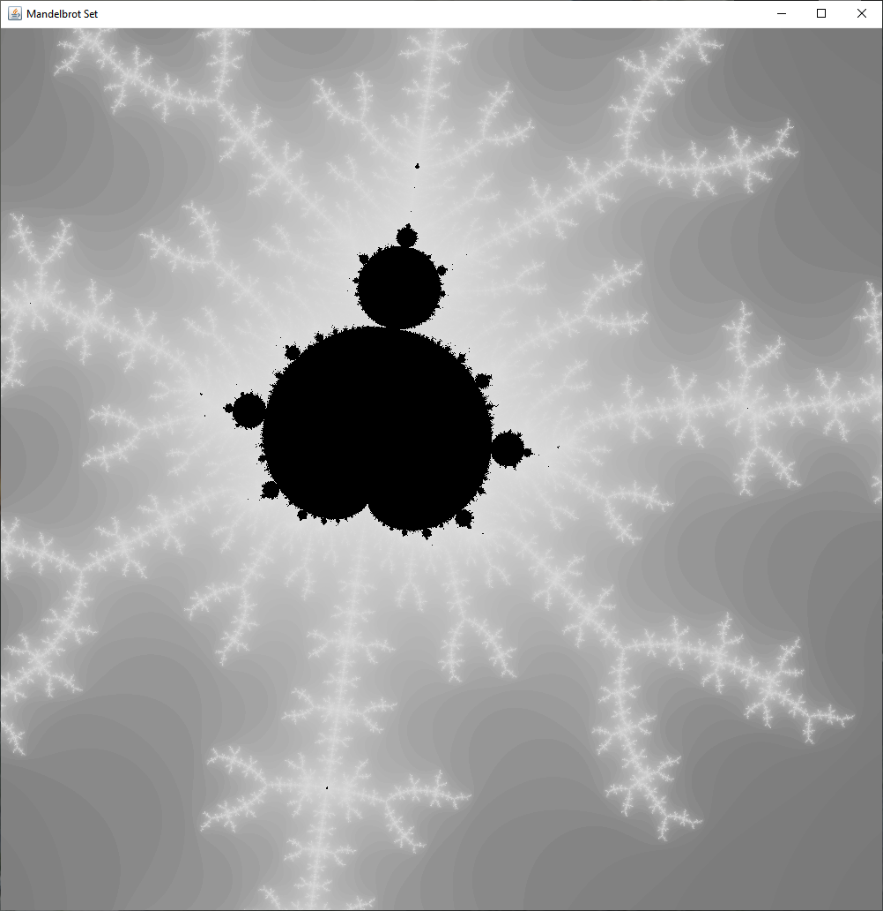
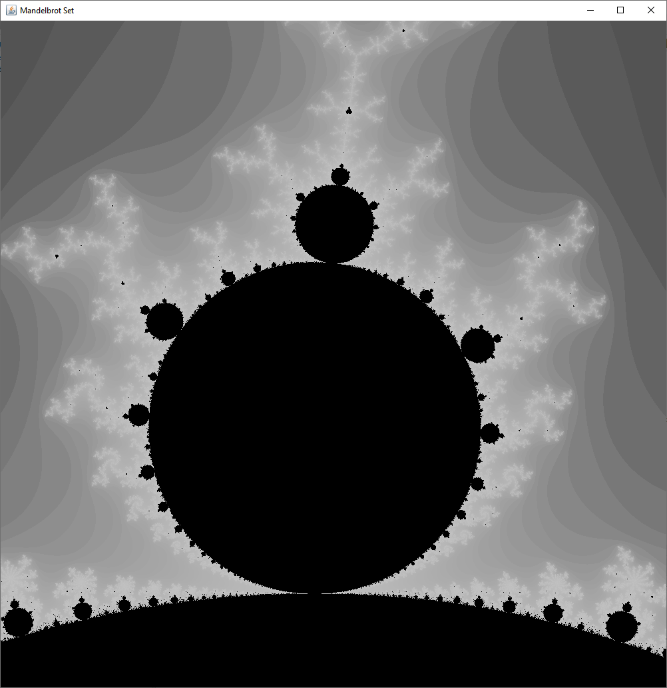
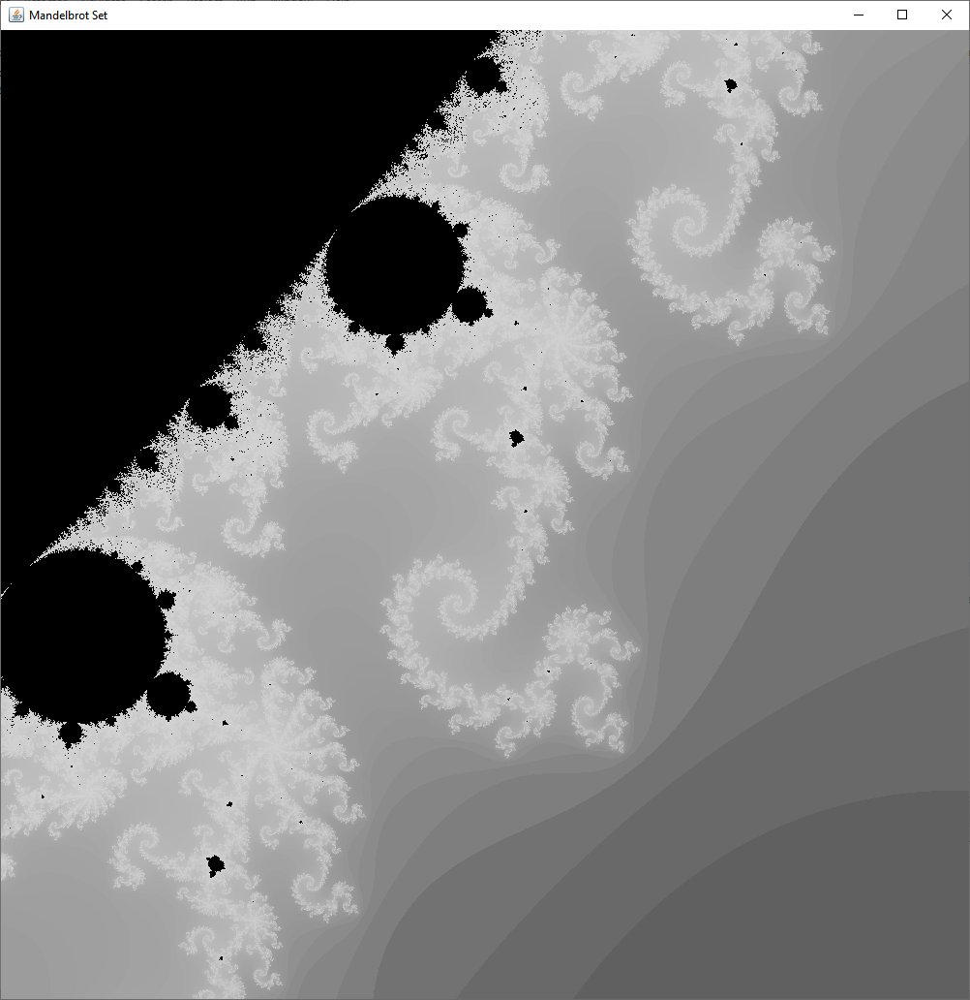
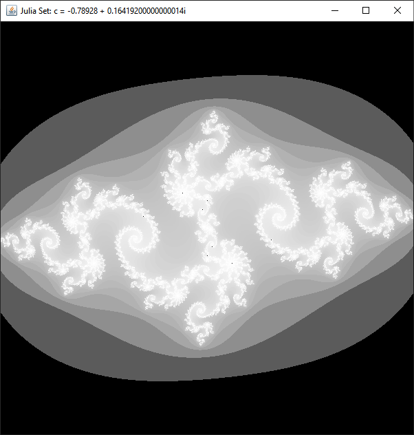

# java-mandelbrotdrawing
This is a simple mandelbrot set image renderer written in java using Eclipse IDE. 

The default window created will be the mandelbrot set in its entirety, drawn from (-2,-2) to (2,2). You can change the initial image setting by changing the initial values of the variables `x0, x1, y0, y1` in Drawing.java.

### Features
* You can zoom in closer by clicking and dragging a rectangle over the window. This will make that rectangle the focus of the new image.
* You can change the max number of iterations by changing `static int max = 250;` in Drawing.java.
* You can see the Julia set for a position on the mandelbrot set by right clicking a location.

### History of the Mandelbrot Set 
The Mandelbrot set has its origin in complex dynamics, a field first investigated by the French mathematicians Pierre Fatou and Gaston Julia at the beginning of the 20th century. This fractal was first defined and drawn in 1978 by Robert W. Brooks and Peter Matelski as part of a study of Kleinian groups. On 1 March 1980, at IBM's Thomas J. Watson Research Center in Yorktown Heights, New York, Benoit Mandelbrot first saw a visualization of the set.

Read more at ([https://en.wikipedia.org/wiki/Mandelbrot_set](https://en.wikipedia.org/wiki/Mandelbrot_set))

### Examples of Mandelbrot Images

### Examples of Julia Set Images

